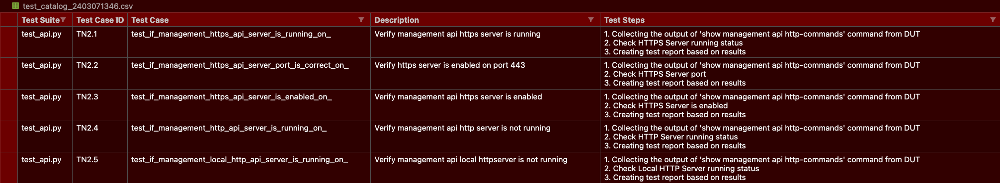

# Vane CLI

Vane has the following Command Line arguments which we will be discussing in
this section

!!! info "Vane Help"
    

    We discussed the --definitions-file and --duts-file flag in the
    [Executing Vane](../executing_vane/executing_vane.md) Section
    and --nrfu flag in the [NRFU Tetsing](../nrfu_setup/nrfu_setup.md)
    Section, we will cover the rest here.

## Using the -- generate-duts-file flag

This flag can be used to generate the duts file with a given name
(via the third argument) for a given inventory and topology file
of a deployed network.

``` text
vane –-generate-duts-file topology.yaml inventory.yaml duts_file
```

**topology.yaml** : this file represents the topology of the lab
you will run Vane against. The topology.yaml file abides by the following
format.

``` yaml title=" Sample topology.yaml" hl_lines="9-24"
veos:
# Define the global vEOS parameters
username: username
password: password
version: 4.27.2F

nodes:
# Define individual node parameters
- DSR01:
    ip_addr: 192.168.0.9
    node_type: veos
    neighbors:
      - neighborDevice: DCBBW1
        neighborPort: Ethernet1
        port: Ethernet1
      - neighborDevice: DCBBW2
        neighborPort: Ethernet1
        port: Ethernet2
      - neighborDevice: DCBBE1
        neighborPort: Ethernet1
        port: Ethernet3
      - neighborDevice: DCBBE2
        neighborPort: Ethernet1
        port: Ethernet4
- DCBBW1:
    ip_addr: 192.168.0.10
    node_type: veos
    neighbors:
      - neighborDevice: DSR01
        neighborPort: Ethernet1
        port: Ethernet1
      - neighborDevice: BLFW1
        neighborPort: Ethernet1
        port: Ethernet3
      - neighborDevice: BLFW2
        neighborPort: Ethernet1
        port: Ethernet4

```

**inventory.yaml** : this file can be downloaded from ACT (if running
Vane against a virtual ACT lab) from the view which reflects
your deployed lab. The inventory.yaml file abides by the following
format.

``` yaml title=" Sample inventory.yaml"
all:
  children:
    CVP:
      hosts:
        cv_ztp:
          ansible_host: 10.255.62.114
          ansible_user: username
          ansible_password: password
        cv_server:
          ansible_httpapi_host: 10.255.62.114
          ansible_host: 10.255.62.114
          ansible_user: username
          ansible_password: password!
    VEOS:
      hosts:
        DCBBW1:
          ansible_host: 10.255.31.234
          ansible_user: username
          ansible_ssh_pass: password!
        DSR01:
          ansible_host: 10.255.50.212
          ansible_user: username
          ansible_ssh_pass: password!

```

!!! success

    Once you have these two files in your vane directory, you can use this command
    to generate a duts file which Vane will run against.

    ``` text
    vane –-generate-duts-file topology.yaml inventory.yaml duts_file
    ```

## Using the -- generate-test-catalog flag

This flag can be used to generate a test catalog csv file for test directory/s passed
as the argument

``` text
vane --generate-test-catalog path/to/test/case/directory
```

This will generate a csv file that has details regarding the test suite, test case id, test case name,
test case description and test case steps for each of the test case belonging to the passed
in test directory. This csv file will be stamped with the time of generation and would be created within
a folder called test catalog.

!!! info "Test Catalog"
    === "Sample .csv file"
        

## Using the -- markers flag

This flag can be used to view all the markers supported by Vane

``` text
vane --markers
```

!!! eos-config "Note"
    Currently supported Vane markers:

    ??? info "View Markers"
        ``` python
        [{'marker': 'filesystem', 'description': 'EOS File System Test Suite'},
        {'marker': 'daemons', 'description': 'EOS daemons Test Suite'},
        {'marker': 'extensions', 'description': 'EOS extensions Test Suite'},
        {'marker': 'users', 'description': 'EOS users Test Suite'},
        {'marker': 'tacacs', 'description': 'TACACS Test Suite'},
        {'marker': 'aaa', 'description': 'AAA Test Suite'},
        {'marker': 'host', 'description': 'Host status Test Suite'},
        {'marker': 'base_feature', 'description': 'Run all base feature test suites'},
        {'marker': 'platform_status', 'description':
        'Run all DUT platform status test suites'},
        {'marker': 'authorization', 'description':
        'Run all authorization test cases in AAA Test Suite'},
        {'marker': 'authentication', 'description':
        'Run all authentication test cases in AAA Test Suite'},
        {'marker': 'accounting', 'description':
        'Run all accounting test cases in AAA Test Suite'},
        {'marker': 'api', 'description': 'API Test Suite'},
        {'marker': 'dns', 'description': 'DNS Test Suite'},
        {'marker': 'logging', 'description': 'Logging Test Suite'},
        {'marker': 'ztp', 'description': 'Zero Touch Provisioning Test Suite'},
        {'marker': 'ntp', 'description': 'NTP Test Suite'},
        {'marker': 'nrfu', 'description': 'Network Ready For Use Test Cases'},
        {'marker': 'pytest', 'description': 'PyTest Test Suite'},
        {'marker': 'environment', 'description': 'Environment Test Suite'},
        {'marker': 'cpu', 'description': 'CPU Test Suite'},
        {'marker': 'memory', 'description': 'Memory Test Suite'},
        {'marker': 'interface', 'description': 'Interface Test Suite'},
        {'marker': 'interface_baseline_health', 'description':
        'Run all interface baseline health test suites'},
        {'marker': 'l2_protocols', 'description': 'Run all L2 protocol test suites'},
        {'marker': 'lldp', 'description': 'Memory Test Suite'},
        {'marker': 'system', 'description': 'System Test Suite'},
        {'marker': 'demo', 'description': 'Tests ready to demo'},
        {'marker': 'physical', 'description': 'Tests that can run on physical hardware'},
        {'marker': 'virtual', 'description': 'Tests that can run on vEOS'},
        {'marker': 'eos424', 'description': 'Validated tests with EOS 4.24'},
        {'marker': 'ssh', 'description': 'Verify SSH version'},
        {'marker': 'vane_system_tests', 'description': 'Verify vane functionalities'},
        {'marker': 'security', 'description': 'Test cases related to security functionalities'},
        {'marker': 'nrfu_test', 'description': 'Network Ready For Use test cases'},
        {'marker': 'routing', 'description': 'Test cases related to routing functionalities'},
        {'marker': 'misc', 'description': 'Miscellaneous test cases'},
        {'marker': 'interfaces', 'description':
        'Test cases related to interface functionalities'},
        {'marker': 'base_services', 'description': 'Test cases related to base services'},
        {'marker': 'xdist_group', 'description':
        'specify group for tests should run in same session.in relation to one another.'
        'Provided by pytest-xdist.'}]
        ```

In Pytest, markers are a way to add metadata or labels to your test functions.
You can use markers to group tests together.
For example, you might have markers like @pytest.mark.smoke or @pytest.mark.functional
to categorize tests based on their purpose.

``` python
@pytest.mark.smoke
def test_smoke_feature():
    # Test code goes here
```

You can now run specific groups of tests using markers. For example,
if you only want to run smoke tests, you can add the **smoke** marker
in the definitions.yaml markers field as follows.

``` yaml title="definitions.yaml" hl_lines="5"
parameters:
  ...
  html_report: reports/report
  json_report: reports/report
  mark: smoke
  processes: null
  report_dir: reports
  results_file: result.yml
  results_dir: reports/results
  test_cases: All
  test_dirs: 
  - sample_network_tests
  report_test_steps: true
  ...
```

Markers make it easy to organize and manage your tests,
especially in larger test suites where you might have various
types of tests with different requirements.

!!! info

    You can see the official documentation of Pytest
    [Markers](https://docs.pytest.org/en/7.1.x/example/
    markers.html#marking-test-functions-and-selecting-them-for-a-run) here.
