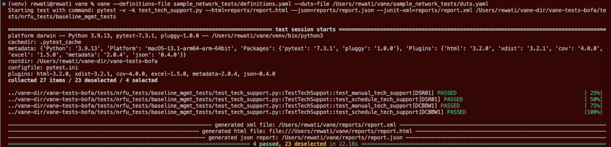
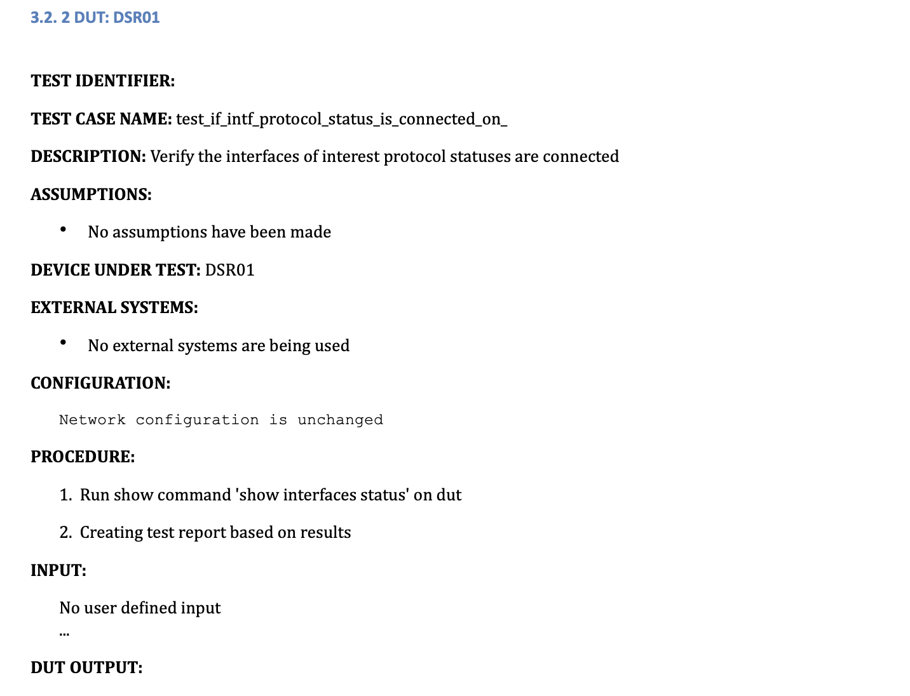
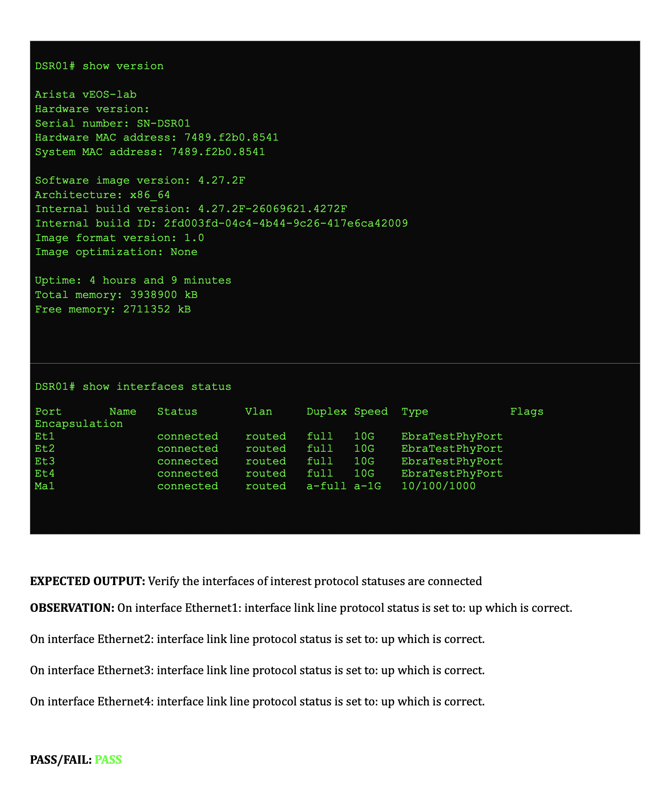
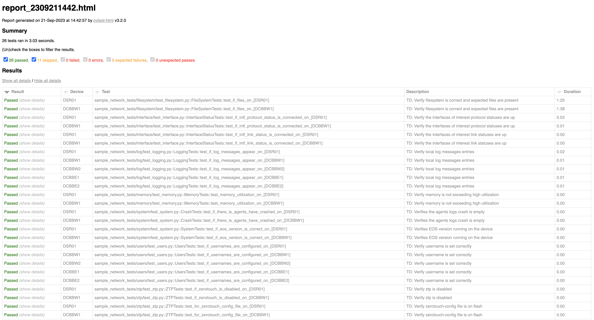
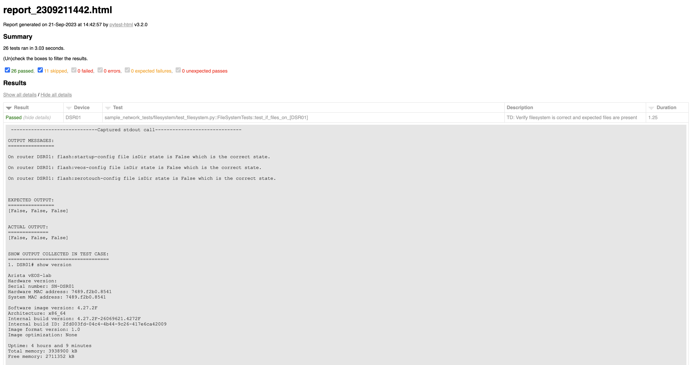
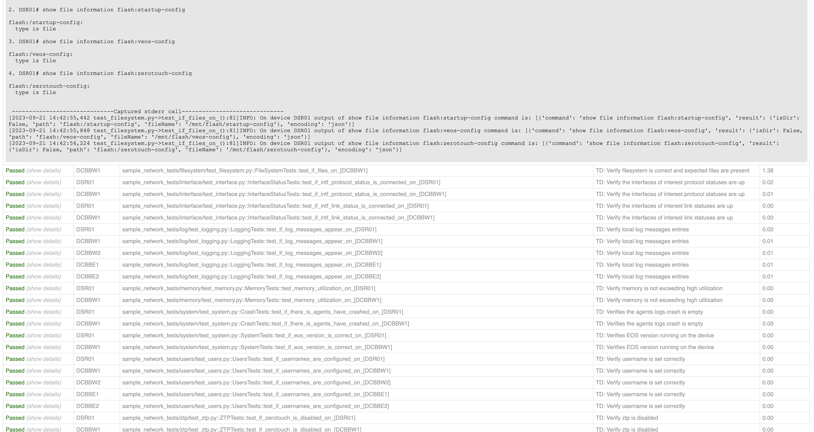

The application is run through the command line by passing in different arguments as needed. Using the command **```vane --help```** shows the different available arguments that can be used. 

```
(vane-py3.9) vane # vane --help

usage: vane [-h] [--definitions-file DEFINITIONS_FILE]
            [--duts-file DUTS_FILE] [--environment ENVIRONMENT]
            [--generate-duts-file topology_file inventory_file]
            [--generate-duts-from-topo topology_file]
            [--generate-test-steps test_dir] [--markers] [--nrfu]

Network Certification Tool

optional arguments:
  -h, --help            show this help message and exit

Main Command Options:
  --definitions-file DEFINITIONS_FILE
                        Specify the name of the definitions file
  --duts-file DUTS_FILE
                        Specify the name of the duts file
  --environment ENVIRONMENT
                        Specify the test execution environment
  --generate-duts-file topology_file inventory_file
                        Create a duts file from topology and inventory
                        file
  --generate-duts-from-topo topology_file
                        Generate a duts file from an ACT topology
                        file.
  --generate-test-steps test_dir
                        Generate test steps for all the tests in the
                        test directory mentioned in the definitions
                        file
  --markers             List of supported technology tests. Equivalent
                        to pytest --markers

NRFU Command Options:
  --nrfu                Starts NRFU tests and will prompt users for
                        required input.
```
!!! info

    Let us get started by discussing some of the necessary flags/arguments, namely definitionas and duts file, what they stand for and how they can be included in order to help you get started with Vane. The remaining arguments and api will be discussed in the [API and CLI Referenec](../api_cli/cli.md) Section.

### Using the definitions file flag

```
--definitions_file definitions.yaml
```

The **Vane definitions file** serves as an informative file to Vane, it includes different information, key fields are highlighted below:

- test_dirs: the source directory which contains the test cases to be run, in our [sample definitions file](https://github.com/aristanetworks/vane/blob/develop/sample_network_tests/definitions.yaml) we pass the sample_network_tests as the test directory. [Sample Network Tests](https://github.com/aristanetworks/vane/tree/develop/sample_network_tests) is a directory of tests provided by us which tests some basics of a network
- report_dir: the directory where report files generated by Vane should be stored,
- test_cases:  list of test cases within the test_dir which need to be run, 

Variables in this file can be edited by the operator to cater to the application execution.


You can provide the definitions file while running Vane as follows:

```
vane –definitions_file definitions.yaml
``` 

!!! eos-config "Note"
    definitions.yaml is the relative path to your definitions file, the sample one in vane repo is at [vane/sample_network_tests/definitions.yaml](https://github.com/aristanetworks/vane/blob/develop/sample_network_tests/definitions.yaml)

If while running vane you do not include this argument as above then vane defaults to using the path mentioned in the [vane/config.py](https://github.com/aristanetworks/vane/blob/develop/vane/config.py) file

``` yaml title=" Sample definitions.yaml" hl_lines="13 19 20 21"
# This is a sample definitions.yaml file which can be used to run vane.
# The fields below can be changed to reflect specific test cases, test directories which need to be run.

parameters:
  eapi_file: tests/unittests/fixtures/eapi.conf
  eapi_template: tests/fixtures/templates/eapi.conf.j2
  eos_conn: eapi
  excel_report: null
  html_report: reports/report
  json_report: reports/report
  mark: 
  processes: null
  report_dir: reports
  results_file: result.yml
  results_dir: reports/results
  setup_show: false
  show_log: show_output.log
  stdout: false
  test_cases: All
  test_dirs: 
  - sample_network_tests
  report_test_steps: true
  generate_test_definitions: false
  master_definitions: master_def.yaml
  template_definitions: tests_definitions.yaml
  test_definitions: test_definition.yaml
  verbose: true
  spreadsheet: tests/fixtures/spreadsheets/PS-LLD-Questionnaire-Template.xlsx
  xcel_definitions: tests/fixtures/spreadsheets/xcel_definitions.yaml
  xcel_schema: tests/fixtures/spreadsheets/xcel_schema.yaml

```

### Using the duts file flag

```
–duts_file duts.yml
```

The **Vane duts file** includes a list of all devices that Vane should run its test cases against, it includes relevant information for each DUT (device under test) such as their hostname and their access credentials. Operators should edit this file to include the devices that they would like to run Vane against.

!!! info
    In the [API](../api_cli/api.md) section later on we talk about how we can use certain API to generate this duts.yaml file instead of having to manually fill in all the details

You can provide the duts file while running Vane as follows:

```
vane –duts-file  duts.yaml
``` 

!!! eos-config "Note"

    duts.yaml is the relative path to your duts file, you can use the sample one in vane repo located at [vane/sample_network_tests/duts.yaml](https://github.com/aristanetworks/vane/blob/develop/sample_network_tests/duts.yaml) to get started.

If while running vane you do not include this argument as above then vane defaults to using the duts file mentioned in the [vane/config.py](https://github.com/aristanetworks/vane/blob/develop/vane/config.py) file

``` yaml title=" Sample duts.yaml" hl_lines="7-25"
# This is a sample duts.yaml file which can be used to run vane.
# This file has been generated from the Vane Demo Lab Topology.

duts:
- mgmt_ip: 10.255.106.71
  name: DSR01
  neighbors:
  - neighborDevice: DCBBW1
    neighborPort: Ethernet1
    port: Ethernet1
  - neighborDevice: DCBBW2
    neighborPort: Ethernet1
    port: Ethernet2
  - neighborDevice: DCBBE1
    neighborPort: Ethernet1
    port: Ethernet3
  - neighborDevice: DCBBE2
    neighborPort: Ethernet1
    port: Ethernet4
  password: cvp123!
  transport: https
  username: cvpadmin
  role: unknown
- mgmt_ip: 10.255.70.133
  name: DCBBW1
  neighbors:
  - neighborDevice: DSR01
    neighborPort: Ethernet1
    port: Ethernet1
  password: cvp123!
  transport: https
  username: cvpadmin
  role: unknown
```

There are a few other flags and descriptions on how to use them which you can explore further in the [API section](../api_cli/api.md), but the ones described above are the necessary ones to get started.

### Executing Vane

Command to Run Vane: 

```
vane
```
!!! eos-config "Note"

    Ensure the DEFINITIONS_FILE and DUTS_FILE variables in config.py are pointing to the correct location for the respective files if you want to run vane using “vane” command, if not you might have to explicitly mention the arguments and give the locations in the command as follows: 

    ```
    vane –definitions-file sample_network_tests/definitions.yaml –duts-file sample_network_tests/duts.yaml
    ```


!!! warning
    **Ensure the Vane-Demo ACT lab is running, when you run Vane using the sample definitions and duts file**

Below is a sample run of vane:



!!! Success "Success"
    If the test cases get executed correctly, it implies vane has been set up correctly, the failure of test cases in itself does not imply an error on vane’s execution side of things.

### Viewing Reports generated by Vane

After Vane has executed successfully, test case reports get generated and populated in the reports folder which exist in the outermost directory of vane. You can view these reports in multiple formats, including json, .docx, html. These reports offer detailed information on the test cases such as test case procedure, input, expected output, pass/fail result, and other relevant observations.

!!! info "Sample Reports"
    === "Sample .docx Report"
        
        
    === "Sample .html Report (Details hidden)"
        
    === "Sample .html Report (Details shown)"   
        
        
