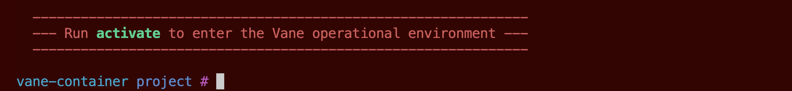

# Via Docker

Vane can be installed by creating and running a docker container.
The [DockerFile](https://github.com/aristanetworks/vane/blob/develop/Dockerfile)
has been provided in the cloned repo

The following steps should get you started

## Clone the Vane Repository

``` text
git clone https://github.com/aristanetworks/vane.git
```

## Enter the Project Root Folder and Build the docker container

This step will ensure it downloads all the dependencies needed to
run Vane in the isolated docker environment, for example it will install
poetry and create a virtual environment with the required dependencies.

!!! warning
    Ensure your docker daemon is running before building the container
    otherwise the *make container* command will error out.

``` text
cd vane
make container
```

## Run the Container

``` text
make run
```

After this command you will see the following screen



## Activate the virtual environment

!!! warning "Warning"
    Make sure you hit activate before trying the Vane commands
    since you need to enter the Vane poetry virtual environment
    with the installed dependencies before Vane commands can be recognized.

    ``` text
    activate
    ```

??? eos-config "Note"
    The Vane project repo is mounted in the docker container as /project directory.
    In order to modify source code or refer to any files which exist within the
    vane repo use the mounted "project" folder instead.
    For eg, the sample_network_tests folder which exists at vane/sample_network_tests
    in the repo can now be found at /project/sample_network_tests.
    Changes to this folder are saved across containers

??? warning "Warning"
    In case by default you do not get dropped in the /project dir,
    then explicitly enter the project folder by executing the following command.
    This is important because the pytest.ini file exists in the /project folder
    and Vane needs that file in the root folder to execute test cases.

    ``` text
    cd /project
    ```

Vane is now ready to be executed and the prompt will look as follows:

``` none
(vane-dev-shell) vane-container project #

(vane-dev-shell) vane-container project # vane --help

usage: vane [-h] [--definitions-file DEFINITIONS_FILE]
            [--duts-file DUTS_FILE] [--environment ENVIRONMENT]
            [--generate-duts-file topology_file inventory_file]
            [--generate-duts-from-topo topology_file]
            [--generate-test-steps test_dir] [--markers] [--nrfu]

Network Certification Tool

optional arguments:
  -h, --help            show this help message and exit

Main Command Options:
  --definitions-file DEFINITIONS_FILE
                        Specify the name of the definitions file
  --duts-file DUTS_FILE
                        Specify the name of the duts file
  --generate-duts-file topology_file inventory_file
                        Create a duts file from topology and inventory
                        file
  --generate-test-steps test_dir
                        Generate test steps for all the tests in the
                        test directory mentioned in the definitions
                        file
  --markers             List of supported technology tests. Equivalent
                        to pytest --markers

NRFU Command Options:
  --nrfu                Starts NRFU tests and will prompt users for
                        required input.
```

To exit out of the container execute the following command:

``` text
exit
```

!!! success "Success"
    Now that you are all set up, navigate to the
    [Executing Vane](../executing_vane/executing_vane.md)
    Section to learn about how to use Vane and its different commands
    to execute test cases on your network.
