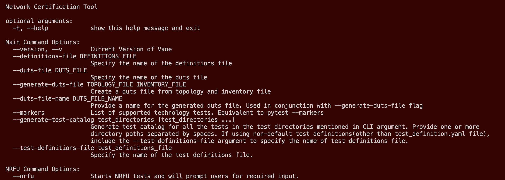

# Via Python Virtual Environment

Vane can be installed using **venv** which is a module in
Python's standard library (as of Python 3.3) that provides
support for creating lightweight, isolated Python environments.

The following steps should get you started:

## Clone the Vane Repository

``` text
git clone https://github.com/aristanetworks/vane.git
```

## Enter the Project Root Directory and Create a Virtual environment

``` text
cd vane
python3.9 -m venv venv
```

## Activate the Virtual Environment

``` text
source venv/bin/activate
```

## Install the requirements

``` text
pip install .
```

!!! warning "Warning"
    You might have to exit and enter the venv again for the
    installation changes to reflect. Additionally, for any
    source code change to reflect in the virtual environment,
    the above command needs to be issued every time after the change.

Vane is now ready to be executed and the prompt will look as follows:

``` text
(venv) vane #
```

```text
(venv) vane # vane --help
```



To exit out of the virtual environment execute the following command:

``` text
exit
```

!!! success "Success"
    Now that you are all set up, navigate to the
    [Executing Vane](../executing_vane/executing_vane.md)
    Section to learn about how to use Vane and its different commands
    to execute test cases on your network.
